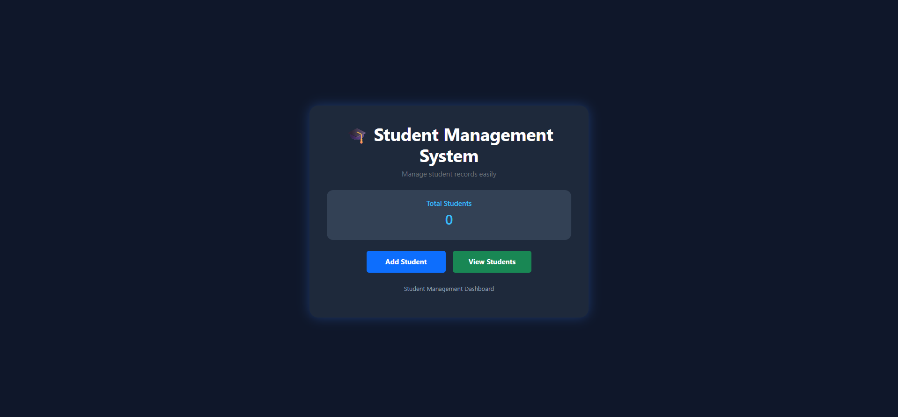
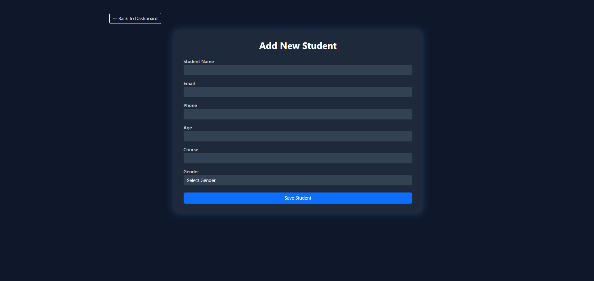
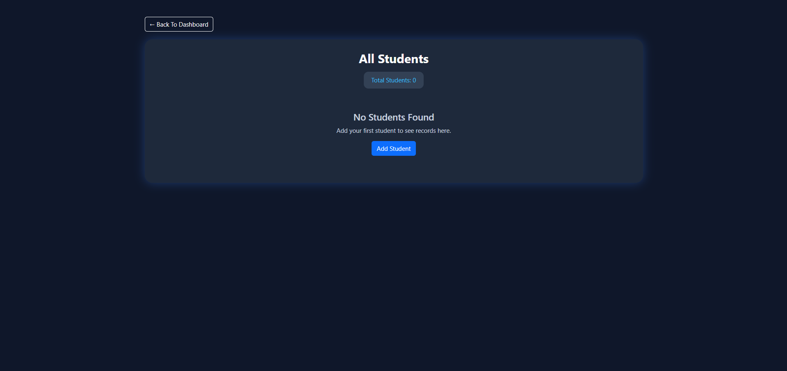

# Student Management System

A web-based Student Management System built using Flask and Bootstrap.

## Features

- Add Student Records
- View Student Records
- Dashboard with Total Student Count
- Success Message Notifications
- Responsive User Interface

## Technologies Used

- Python
- Flask
- HTML
- CSS
- Bootstrap
- Jinja2

## Screenshots

### Dashboard

### Add Student Page

### View Students Page

## Project Structure

Student-Management-System
│
├── app.py
├── README.md
├── screenshots
│   ├── dashboard.png
│   ├── add_student.png
│   └── view_student.png
│
└── Templates
    ├── index.html
    ├── add_students.html
    └── view_students.html